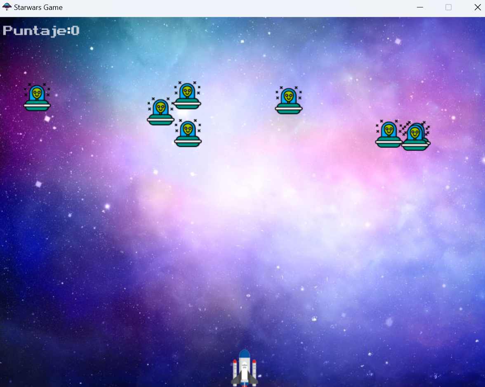

<h1 align="center"> Naves y Disparos </h1>

 

## Descripcion  📋
---
El proyecto "Naves y Disparos" es un juego de disparos ambientado en el espacio donde el jugador controla una nave espacial y debe derrotar a una serie de enemigos alienígenas que aparecen en la pantalla. El objetivo es acumular la mayor cantidad de puntos posible antes de que los enemigos alcancen el fondo de la pantalla y el jugador pierda.

## Materiales  📦

A continuación se muestra una lista de los materiales requeridos, junto con la cantidad y el precio de cada uno:

  Nombre del Material  | Cantidad  | Precio Unitario (USD)  
|----------------------|-----------|-------------------------
| Ordenador            | 1         | Variable               |
| Altavoces            | 1         | Variable               |
| Conexión a Internet  | 1         | Variable               |
| Teclado y Ratón      | 1         | Variable               |

## Total-estimado  💰

El costo total estimado del proyecto varía dependiendo de los materiales que ya se posean. 

## Esquemas 📊

El juego está basado en una serie de bucles que actualizan continuamente la posición de los elementos en la pantalla, detectando colisiones entre la nave del jugador y los enemigos, así como entre las balas disparadas y los enemigos. No se requieren esquemas adicionales para la implementación del juego.

## Instalacion-y-simulacion  🔧

_Para ejecutar el juego, sigue estos pasos:_

1. Asegúrate de tener Python 3 instalado en tu sistema.
2. Instala la biblioteca Pygame ejecutando `pip install pygame` en tu terminal.
3. Descarga los archivos del juego.
4. Abre tu terminal y navega hasta la carpeta donde guardaste los archivos del juego.
5. Ejecuta el comando `python nombre_del_archivo.py`.
6. ¡Disfruta del juego!

